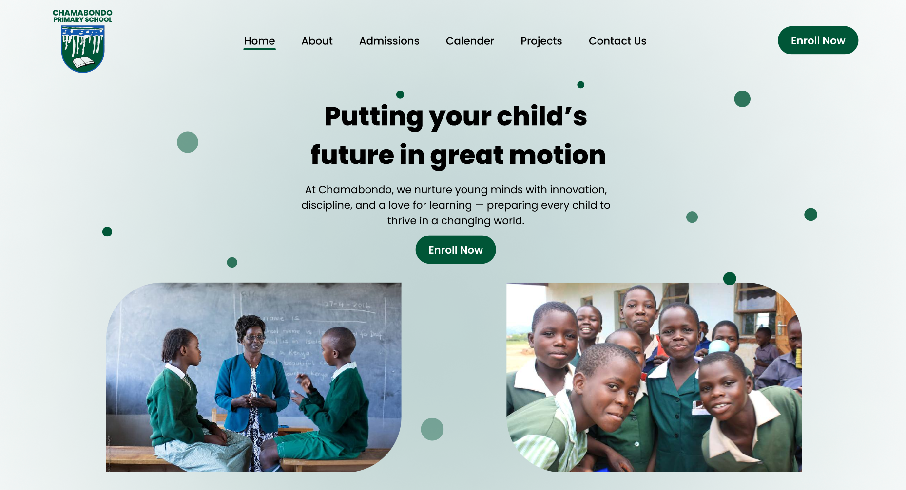

# Chamabondo Primary School Website



*Welcome to the official repository for the Chamabondo primary school website! This project serves as an online hub for students, parents, teachers, and the community to stay informed and connected.*

## 🌐 Overview
This website provides essential information about the school, including:


- 📅 Term dates and events
- 🧑‍🏫 Staff and contact details
- 📚 Curriculum and class pages
- 📝 Newsletters and announcements
- 📸 Photo galleries and school life highlights


## 🎯 Purpose
- To create a user-friendly, accessible, and informative website that reflects the school’s values, supports communication, and celebrates student achievement.


## 👥 Target Audience
- Parents and guardians
- Current and prospective students
- Staff members
- Local community

## 🛠️ Built With
**Client**: 🛠 [Vite](https://vitejs.dev/), ⚛ [React](https://react.dev/), 🎨 [Tailwind CSS](https://tailwindcss.com/)

**Server**: ⚡ [Bun](https://bun.sh)

## 🚀 Getting Started

Clone the project

```bash
  git clone https://github.com/specialbrocoli/chamabondo
```

Go to the project directory

```bash
  cd chamabondo
```

Install dependencies

```bash
  npm install
  # or
  bun install
```

Start the server

```bash
  npm run dev
  # or 
  bun run dev
```

## Project structure 

```
.
├── bun.lock
├── eslint.config.js
├── index.html
├── node_modules
├── package-lock.json
├── package.json
├── public
├── READMEe.md
├── src
└── vite.config.js
```

## 🎨 Design Goals
- Simple and clean layout
- Mobile-responsive design
- Easy to navigate
- Consistent with the school's branding and colors